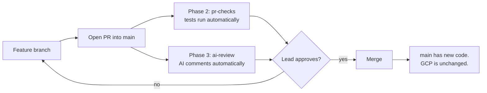
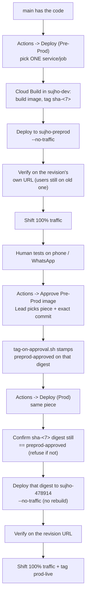

# Sujho DevOps Plan — Full Repository Documentation

**Status: planning + local paper only. Phases 1–6 are not live.**  
Publishing *this* repo so Leads can read it does **not** change `Sujho/sujho`, Prod (`sujho-478914`), or Cloud Build. Live today is still: push to `sujho` `main` → old Cloud Build → often `:latest`.

Every `apply-*.sh` defaults to **dry-run**. Nothing mutates `Sujho/sujho` or GCP unless a **Lead** explicitly asks and someone types `--apply` (GCP scripts also refuse placeholder org/billing/WIF IDs).

This document exists so a Lead can read **this file alone** and understand the plan — including what is still unsafe to apply.

---

## Table of contents

0. [Safety rules (read first)](#0-safety-rules-read-first)
1. [What this repository is](#1-what-this-repository-is)
2. [The mental model (read this first)](#2-the-mental-model-read-this-first)
3. [Glossary](#3-glossary)
4. [Repository map](#4-repository-map)
5. [How code and deploys actually flow](#5-how-code-and-deploys-actually-flow)
6. [Phase 1 — protect `main`](#6-phase-1--protect-main)
7. [Phase 2 — PR checks](#7-phase-2--pr-checks)
8. [Phase 3 — AI review gate](#8-phase-3--ai-review-gate)
9. [Phase 4 — promotion system (services)](#9-phase-4--promotion-system-services)
10. [Phase 4 / jobs — Cloud Run Jobs](#10-phase-4--jobs--cloud-run-jobs)
11. [Phase 5 — cut on purpose](#11-phase-5--cut-on-purpose)
12. [Phase 6 — weekly mutation + eval](#12-phase-6--weekly-mutation--eval)
13. [Cross-cutting systems](#13-cross-cutting-systems)
14. [How to review this repository](#14-how-to-review-this-repository)
15. [Open items — decisions still needed](#15-open-items--decisions-still-needed)
16. [Local review history](#16-local-review-history)

---

## 0. Safety rules (read first)

These are the rules this repo is built on. Breaking them is how Prod gets hurt. They apply to Leads and to Prince.

**Lead 60-second checklist**

| Do | Do not |
|---|---|
| Read this file, then `docs/sujho-github-workflow-plan-full.md` | Assume Phases 1–6 are live because this repo is on GitHub |
| Clone, comment, run `python3 validate.py` in each `phaseN/` | Pass `--apply`, `--4c`, `--4d`, or `--remote` unless you asked for that in writing |
| Treat `phase*/workflows/*.yml` as **samples on disk** | Copy them into `.github/workflows/` on *this* repo (GitHub would then try to run them here) |
| Treat `tests/` and `Eval-Suite/` as **read copies** | Run `Eval-Suite/run.py` from this repo (live APIs, spend, real graph) |
| Note the two paper bugs in [§0.5](#05-must-fix-in-the-papers-before-any-phase-4---apply) | `--apply` Phase 4 until registry + Prod Developer Connect match live |

### 0.1 What this GitHub push is (and is not)

| This is | This is not |
|---|---|
| A **paper** repo for Leads to read and review | An install onto `Sujho/sujho` |
| Safe to host on GitHub as documentation | A claim that Pre-Prod, WIF, or the new forms are live |
| Dry-run scripts you can run on a laptop | Permission to run `--apply` |

Cloning or starring this repo does nothing to Prod. Running `./apply-phase4.sh --apply` (or `--apply --4c` / `--apply --4d`) **would**.

GitHub only executes workflow files under `.github/workflows/`. This paper repo has **none**. Generated YAML lives under `phase*/workflows/` and `phase*/ci/` on purpose so opening this repo does not start deploys, WIF logins, or eval spend. Do not add `.github/workflows/` here, and do not turn on Actions on this documentation repo as if it were `Sujho/sujho`.

### 0.2 Hard stops — do not do these unless a Lead asked *in writing / in chat*, then still wait

- Do **not** pass `--apply` on `phase1/`–`phase6/` (or `provision-projects.sh` / `provision-wif.sh`).
- Do **not** run `prove-phase1.sh` until Phase 1 is meant to go live (it opens a real PR on GitHub).
- Do **not** `git push` these files onto `Sujho/sujho` by hand. Landing them is a later PR a Lead reviews.
- Do **not** create GitHub branches named `dev` or `pre-prod`. Ship path is `main` only.
- Do **not** recreate or delete remote `dev` / `pre-prod` branches.
- Do **not** turn on auto-deploy (no Cloud Build **push** trigger for the new split YAML; leftover live push triggers stay off until a Lead turns them off in the Cloud Build console).
- Do **not** put API keys, WIF keys, or `.env` into **GitHub Secrets**. Secrets stay in **GCP Secret Manager**. GitHub gets **Variables** only: `GCP_WIF_PROVIDER` and the four `GCP_WIF_SERVICE_ACCOUNT_*` names.
- Do **not** grant `github-deploy-preprod` any role on Prod, or `github-deploy-prod` any role on Pre-Prod.
- Do **not** stamp `preprod-approved` from weekly eval. Eval **reports only**. A Lead stamps **one piece** + **that commit** via `approve-preprod`. `--all` on `tag-on-approval.sh` is refused unless `SUJHO_APPROVE_ALL=1` (emergency).
- Do **not** run `Eval-Suite/run.py` from this repo (live OpenAI/Gemini/Neo4j, spend, real graph). Copy here is for reading.
- Do **not** copy Prod secret **values** into Pre-Prod or Dev. Names may match; values must not.
- Do **not** skip git hooks (`--no-verify`) on any later apply PR.
- Do **not** force-push `main` / `master`.
- Do **not** commit real `ORG_ID`, `BILLING_ACCOUNT_ID`, WIF provider names, service-account keys, or Secret Manager values into this repo (or into GitHub Issues/PR comments). Placeholders stay placeholders until a Lead runs provision **off git**, locally.
- Do **not** copy Prod user data (including minors) into Pre-Prod or Dev until Leads decide anonymization. That copy is a later, Lead-owned step — not a script in this repo.
- Do **not** move workflow YAML from `phase*/` into `.github/workflows/` on **this** paper repo.

Prince (`@Prince-sujho`) is **not** a Code Owner. His Approve must not satisfy the Lead gate. Code Owners when this lands on `Sujho/sujho` are the Leads (`@arnavtayal`, `@abhishektayal2802`).

### 0.3 How ship is supposed to work (two human clicks, then a third for Prod)

1. **Lead Approve** on the PR into `Sujho/sujho` `main`. AI comments; it does not merge. **Merge does not deploy.**
2. Open the **environment file** (Pre-Prod vs Prod is the file you open). Pick **one** service or job. Run workflow from **`main` only** (the form refuses other refs).
3. After a Lead **tested that commit on Pre-Prod**: Actions → **Approve Pre-Prod image** → that piece + that full commit. Then Prod, **same image, no rebuild**.

One click = one piece. Empty rollback must not send users to a newer Ready revision that never had traffic.

### 0.4 What local checks proved vs what they did not

Safe to believe from laptop tests: generators, IAM *text* in the provision scripts, rollback equals-form, gitlink SHAs / Dockerfiles on a local clone, `/health` and `/version` on the six HTTP services.

**Not proven, and must not be assumed:** WIF login, Kaniko push, Cloud Run deploy, traffic shift, `preprod-approved`, rulesets on GitHub.

### 0.5 Must fix in the papers before any Phase 4 `--apply`

These are real mismatches with **live** Prod Cloud Build. Applying today would aim at the wrong registry / wrong Developer Connect name:

1. **Registry.** Live: `asia-south1-docker.pkg.dev/$PROJECT/<service>/api` (jobs: `…/knowledge-store/jobs`). Papers: `asia-south1-docker.pkg.dev/sujho-dev/services/<image>` (jobs image `knowledge-store-jobs`). `sujho-dev` Artifact Registry does not exist yet.
2. **Prod Developer Connect.** Live: `sujho-github-dc-org`. Generated YAML default: `_DC_CONNECTION: sujho-github-dc`. Catalog field `dc_connection_prod` is **not used** by `generate_cloudbuild.py`.

Also remaining on a typical `sujho` checkout: old `ci/*-deploy.yaml` (`revision: main`, `:latest`, `--set-env-vars`, trigger-guard); no `.github/` / `CODEOWNERS` / `jobs/` until a later PR.

### 0.6 Scripts that can still hurt if misused

| Script | Default | Harm if `--apply` / live flags |
|---|---|---|
| `phase1/apply-phase1.sh` | dry-run | Writes CODEOWNERS + rulesets on GitHub |
| `phase1/prove-phase1.sh` | live PR | Opens a real PR (only after Phase 1 is meant to be live) |
| `phase2`–`phase4` `apply-*.sh` | dry-run | PRs files into `Sujho/sujho` `main` |
| `phase4` `--apply --4c` | refused unless `--4c` | Creates GCP projects / IAM |
| `provision-wif.sh --apply` | dry-run | Creates WIF + GCP IAM |
| `phase5/apply-phase5.sh --apply` | **refused on purpose** | Checker was cut; stamp is `approve-preprod` |
| `phase6/apply-phase6.sh` | dry-run | Weekly jobs only; must **not** stamp |
| `verify-phaseN.sh --remote` | read-only `gh` | Does not mutate; still talks to GitHub |

Placeholders (`REPLACE_WITH_…`) are refused. That is a safety check, not a hint to paste production IDs into git.

### 0.7 Product tests copied here

`tests/` is a **read copy** of a **local untracked** tree on a laptop checkout of sujho. It is **not** on GitHub `main` of the product. It cannot run inside this repo alone (no product packages, no live services). Known unit/api failures exist in that product tree (empty handle IndexError, campaign spend, `limit=0` 422 vs 200, gift-card 400 vs 422, influencer 409/overlap, session extraction 500 vs 404, webhook 500 vs 403). Do not treat a green `phaseN/validate.py` as “product tests are green.”

`Eval-Suite/` is the same kind of read copy. `sujho/evals/` is an **older, different** tree and was not copied. Do not run eval from here.

---

## 1. What this repository is

`DevOps-Plan` is **not** the Sujho product code. It is a self-contained planning and tooling repository that designs, generates, and locally tests the CI/CD system that will eventually live inside `Sujho/sujho` (the product monorepo) on GitHub, plus the GCP setup that system depends on.

Everything here falls into one of three categories:

- **Generators** (`generate_*.py`) — Python scripts that render GitHub Actions workflow files and Cloud Build YAML from small JSON catalogs. You never hand-edit a generated file; you edit the catalog or the generator and regenerate.
- **Appliers** (`apply-phaseN.sh`) — the only scripts that are allowed to touch the real `Sujho/sujho` GitHub repo, and only when run with `--apply`. Every one of them defaults to a dry-run that prints exactly what it would do.
- **Local test suites** (`validate.py`, `verify-phaseN.sh`) — self-contained `unittest` suites with **no network calls**, run with plain `python3 validate.py`. Every phase has one. As of this writing, every one of them passes (counts in the phase sections below).

Nothing here has been pushed to `Sujho/sujho`, no GitHub ruleset has been created, no GCP project has been created, and no secret has been read. The only "real" GitHub/GCP actions this repo can take are gated behind explicit flags a Lead has to type.

---

## 2. The mental model (read this first)

The one-sentence version: **a machine does the mechanical work; a human decides where and when it ships.**

- **GitHub has one branch: `main`.** There is no `dev` branch, no `pre-prod` branch. Everyone — Leads and the engineer — opens a feature branch and PRs into `main`.
- **Dev / Pre-Prod / Prod are GCP *projects***, not GitHub branches: `sujho-dev` (playground + build/push registry), `sujho-preprod` (phone/WhatsApp testing, own databases), `sujho-478914` (real users, today's only project that actually exists).
- **Merging a PR never deploys anything.** Merge only changes what's on `main`. GCP is untouched until a human opens GitHub Actions and clicks **Run workflow**.
- **One click = one piece.** There is no "update everything" button. A dispatch form always asks for exactly one service or job, and updates only that one.
- **Build once, promote the same artifact.** An image is built once (tagged `sha-<7 chars of the commit>`), tested on Pre-Prod, and — only after a Lead has actually looked at it running there — stamped `preprod-approved`. Prod never rebuilds; it deploys the exact digest that carries that stamp. If the digest a Prod run finds doesn't match, it refuses.
- **Secrets live in GCP Secret Manager only, never GitHub Secrets.** The same secret *names* exist in every project; only the *values* differ per project. GitHub only ever holds Workload Identity Federation (WIF) configuration — how to log in to GCP, not credentials themselves.
- **A Pre-Prod credential cannot touch Prod, ever.** This is enforced by GCP IAM (four separate service accounts, see [§13.2](#132-the-four-wif-identities)), not by which file you happened to open.

If you remember only one thing: **this whole repo is the machine that lets "I want to update Pre-Prod" become one click, without ever letting a click alone reach real users.**

---

## 3. Glossary

| Term | Meaning here |
|---|---|
| **`main`** | The one GitHub branch everyone PRs into. Also the only branch these deploy workflows are allowed to dispatch from (enforced in code, see §13.3). |
| **Dev / `sujho-dev`** | A GCP project. Free playground + where service/job images are built and pushed (shared Artifact Registry). |
| **Pre-Prod / `sujho-preprod`** | A GCP project for phone/WhatsApp testing. Does not exist yet — a Lead/owner must create it (`provision-projects.sh`). Own Firestore/Neo4j/GCS, refreshed by periodically copying **from** Prod (never written back). |
| **Prod / `sujho-478914`** | The GCP project real users hit today. Already exists. |
| **CODEOWNERS gate** | GitHub's mechanism that requires a Lead's approval (not the PR author's) before a PR into `main` can merge. |
| **WIF (Workload Identity Federation)** | How a GitHub Actions run authenticates to GCP without ever storing a long-lived key — GitHub proves its identity via OIDC, GCP exchanges that for a short-lived token scoped to one service account. |
| **`workflow_dispatch`** | The GitHub Actions trigger type that only starts when a human clicks **Run workflow** on the Actions tab. Nothing in this repo uses `push` to deploy. |
| **Digest** | The immutable `sha256:...` content hash of a built container image — as opposed to a tag (like `sha-abc1234` or `preprod-approved`), which is a mutable pointer that can be moved. Deploys pin to a digest wherever it matters, precisely to avoid a tag moving out from under a deploy (a TOCTOU bug). |
| **`preprod-approved`** | A registry tag applied to exactly one image digest by a Lead, by hand, after they tested that exact commit on Pre-Prod. The only thing that makes a Prod deploy possible. |
| **`prod-live`** | A registry tag applied automatically after a successful Prod deploy — a record of "this is what's actually running," not a gate. |
| **Gitlink** | A git submodule pointer (mode `160000`) recording the exact commit SHA of a service repo (e.g. `redirect_service`) inside the `sujho` monorepo tree. Cloud Build checks these out at that exact SHA — never a moving branch. |
| **Fail-open vs fail-closed** | Fail-open: if the check itself can't run (billing, missing key, parse error), it does not block the merge/deploy. Fail-closed: any doubt blocks. AI review and eval are fail-open by design (they must never be the reason a PR can't merge). Digest/promotion checks are fail-closed by design (any doubt must block a Prod deploy). |

---

## 4. Repository map

```
DevOps-Plan/
├── README.md                            ← you are here (renders as the repo homepage on GitHub)
├── action-pins.json                     ← every third-party GitHub Action, pinned to a full commit SHA
├── pin_github_actions.py                ← rewrites uses: lines in every workflow file to match action-pins.json
│
├── phase1/   CODEOWNERS + branch protection on `main`
├── phase2/   Required PR checks (tests) before merge
├── phase3/   AI code review gate on every PR
├── phase4/   The promotion system: build → Pre-Prod → Lead approval → Prod, + rollback
│   └── jobs/   The same system, adapted for Cloud Run *Jobs* (run-to-completion, not HTTP)
├── phase5/   Deliberately emptied — see §11
├── phase6/   Weekly drift detection (mutation testing + eval replay), reporting-only
│
├── tests/         ← one tests folder: copy of Desktop/Sujho/sujho/tests. Does not run here alone.
├── Eval-Suite/    ← copy of Desktop/Sujho/sujho/Eval-Suite (do not run live models from this repo)
│
└── docs/
    └── sujho-github-workflow-plan-full.md   ← the short, plain-English version of this whole plan
```

Every `phaseN/` directory has the same internal shape:

| File | Role |
|---|---|
| `lib.sh` | Constants + shell helpers for that phase (repo lists, file destinations). Sourced by `apply-*.sh` / `verify-*.sh`, never run directly. |
| `apply-phaseN.sh` | The only script allowed to write to GitHub. Dry-run by default; `--apply` required to mutate anything. |
| `verify-phaseN.sh` | Checks local invariants (always) and, with `--remote`, checks the real GitHub state matches what's expected. Read-only even with `--remote`. |
| `validate.py` | Pure local `unittest` suite. No network. This is what you run to check "is this phase's logic and generated output correct." |
| `workflows/*.yml` / `.yaml` | The actual GitHub Actions workflow files that would land on `Sujho/sujho`. |

`phase1/` also holds `prove-phase1.sh` — a script that, once Phase 1 is actually applied, opens a real throwaway PR to *prove* the Lead gate works (not just that the config looks right), then closes it unmerged.

---

## 5. How code and deploys actually flow

### 5.1 Getting code onto `main`



The PR author can never approve their own PR (Phase 1). The AI review can never block a merge on its own — a billing outage, a parse error, or the spend cap all fail the check *open* (Phase 3). Tests can block a merge, but only once the `pr-checks` job has been observed running at least once (you cannot require a check GitHub has never seen).

### 5.2 Shipping one piece to Pre-Prod, then Prod



Nothing in this chain runs on a schedule or on merge. Every box in the top half up to "Human tests" happens because someone clicked **Run workflow**. Every box below "Human tests" happens because a **Lead**, specifically, clicked **Run workflow** on the approval form and typed the exact commit they tested.

### 5.3 Rollback (independent of the chain above)

A separate pair of dispatch forms per environment shifts Cloud Run traffic to an older revision — no rebuild, no retag. It deliberately refuses to send users to a revision *newer* than the one currently serving (that would be rolling **forward** into whatever just failed verification), and only considers revisions that are Ready and older than the one at 100% traffic. See [§9.6](#96-rollback).

---

## 6. Phase 1 — protect `main`

**Purpose:** make sure nobody — including the engineer who isn't a Lead — can merge their own change into `main` without a Lead's review, and that this is a real GitHub-enforced rule, not a convention.

| File | What it does |
|---|---|
| `CODEOWNERS` | Maps `*` (everything) and `/ci/`, `.github/` specifically to the two Leads only. The engineer (`@Prince-sujho`) is never listed as an owner of anything. |
| `rulesets/main.json` | The GitHub branch ruleset for `main` on the nine "full-treatment" repos: PR required, code-owner review required, one merge-commit method only (no squash/rebase), org-admin bypass restricted to PR-only (no silent direct push). |
| `rulesets/light-touch-main.json` | Same idea, lighter: for `design-system`, `docs`, `infra`, `hiring`, `www` — PR required, but code-owner review is off. |
| `lib.sh` | Shared constants (`ORG`, `LEADS`, the two repo lists) and helper functions every later phase's scripts source: `ensure_branch_from_main`, `sync_codeowners_to_main`, `upsert_ruleset`, and the `gh_mutate` dry-run wrapper that every GitHub-writing call in this repo goes through. |
| `apply-phase1.sh` | Puts `CODEOWNERS` on `main` (opening a PR if a direct commit is blocked, as it should be), then upserts the branch ruleset — but only on repos where the running user is actually an admin. |
| `verify-phase1.sh` | `--remote`: reads the real ruleset from GitHub and checks the parameters (code-owner review on, merge-only, no always-bypass) actually match. |
| `prove-phase1.sh` | Opens a real dummy PR on `redirect-service` to prove, empirically, that the engineer's own approval isn't enough and squash isn't offered. Closes the PR unmerged afterward. |
| `validate.py` | **13 local tests**, no network: CODEOWNERS parsing rules, that the engineer is never an owner, ruleset JSON shape (merge-only, code-owner review required, no direct-push bypass). |

**Run locally:** `cd phase1 && python3 validate.py` — currently passes (13/13).

---

## 7. Phase 2 — PR checks

**Purpose:** a required, automatic test run on every PR into `main`, sized to a team whose test suite is still being written — it must not hang a required check on a repo that has no tests yet, and it must not punish a docs-only PR for skipped tests.

| File | What it does |
|---|---|
| `workflows/pr-checks.yml` | Runs on the `sujho` umbrella repo only. Executes `tests/ci/pipeline.py` (the real 836-test suite: static/secrets/unit/api/eval-checks/gates/coverage), plus best-effort integration/e2e (needs a Firestore emulator — allowed to fail without failing the gate), plus a diff-coverage check on changed lines only. A final `pr-checks` job collapses all of that into one required-check name so a skipped suite (docs-only PR) still comes back green instead of hanging forever. |
| `workflows/pr-checks-admin.yml` | Same idea, but for the `admin` repo, which is Node — lint + `npm test`, same green-on-skip logic. |
| `scripts/coverage_ratchet.py` | Compares head vs. base coverage; fails only if coverage **drops**. Missing base coverage (new suite) is treated as 0, so a broken base never blocks a PR; missing head coverage after tests ran *is* a failure. |
| `rulesets/main-required-checks.json` | The ruleset that actually requires the `pr-checks` job once it exists — never installed until that job has been observed running at least once. |
| `lib.sh` | Which repos get the Python suite (`sujho`), which get the Node one (`admin`), and which are explicitly skipped (`text-agent`, `user-service`, `whatsapp-adapter`, `document-worker`, `redirect-service`, `knowledge-store`, `sujho-ops-mcp` — the test suite lives in the umbrella tree, not in each service repo). |
| `apply-phase2.sh` | Puts the workflow files on `main` via PR. A separate `--require-checks` flag (kept deliberately apart from `--apply`) upserts the required-check ruleset, and **refuses** if `pr-checks` has never actually appeared on a run. |
| `verify-phase2.sh` | `--remote` also checks that nothing generic like `lint`/`unit-tests` got required directly (that would hang on docs-only PRs) — only the collapsed `pr-checks` gate job may be required. |
| `validate.py` | Local tests covering the workflow YAML shape, that the umbrella suite (not a per-service `pytest`) is what runs, and the coverage ratchet logic itself. |

**Run locally:** `cd phase2 && python3 validate.py`.

---

## 8. Phase 3 — AI review gate

**Purpose:** a Claude-based reviewer comments on every non-trivial PR before a Lead approves, without ever being able to block a merge by itself if something on the billing/auth/parsing side goes wrong, and without exposing GCP or API credentials to code from an untrusted PR.

| File | What it does |
|---|---|
| `workflows/ai-review.yml` | **Split into two jobs on purpose.** `collect` checks out the PR head (untrusted code), runs Semgrep/Bandit scoped to just the diff, and uploads the diff + findings as an artifact — it never sees a credential. `review` checks out the **base branch** only, downloads that artifact, authenticates to GCP (per-identity WIF, see §13.2), fetches the Anthropic key from Secret Manager, masks it (`::add-mask::`) before writing it to `$GITHUB_ENV`, and runs the actual model call. This closes the classic `pwn_request` hole — a malicious PR diff is never executed in the job that holds secrets. A final `ai-review` gate job collapses the result: fail only on an "Important" finding; a fail-open result, a trivial diff, or a draft PR all come back green so the check can never hang or silently block. |
| `scripts/ai_review.py` | Two-pass review: pass 1 reads the diff + `REVIEW.md` rubric + static-analysis findings and produces findings plus a true/false-positive triage of each static finding; pass 2 is a second, independent pass explicitly told not to repeat pass 1's findings (single-pass LLM review recall is known to be weak — two independent passes catch materially more). Nits are capped at 5 per review. **Fails open** (writes `fail_open: true`, empty findings, exits 0) on: spend cap hit, missing API key, missing diff, or any exception from the model call itself — never lets an infra problem block a merge. |
| `REVIEW.md` | The actual rubric: what's "Important" (blocks merge) vs. "nit" (never blocks) vs. skipped entirely (lockfiles, generated code, digest-only CI diffs). Repo-specific correctness traps are called out explicitly — e.g. WhatsApp webhook duplicate-delivery / ordering, `whatsapp` service's `max-instances=1` in-process state coupling, per-service Cloud Run timeout budgets. |
| `rulesets/main-required-ai-only.json` / `main-required-checks.json` | Two variants of the required-check ruleset — the umbrella + `admin` require both `pr-checks` and `ai-review`; every other full-treatment repo (no test suite of its own) requires `ai-review` only. |
| `apply-phase3.sh` | Same PR-then-require-once-observed pattern as Phase 2. |
| `validate.py` | **26 local tests** — including that `collect` genuinely has no credentials or the review script in it, that the API key gets masked before hitting `$GITHUB_ENV`, that Semgrep is diff-scoped, and the whole two-pass merge/cap/fail-open logic of `ai_review.py` itself (mocked, no real API calls). |

**Model in use:** `claude-sonnet-4-6` (see [§15](#15-open-items--decisions-still-needed) — this is a currently-served, working model; a newer/cheaper option exists and is worth a deliberate swap, not an urgent fix).

**Run locally:** `cd phase3 && python3 validate.py` — currently passes (26/26).

---

## 9. Phase 4 — promotion system (services)

This is the largest and most security-sensitive part of the repo: it turns "build once, test on Pre-Prod, a Lead approves, deploy the same bits to Prod" into a small number of GitHub Actions dispatch forms, backed by generated Cloud Build configs and a hardened GCP identity model.

### 9.1 The catalog — single source of truth

`catalog.json` lists every Cloud Run **service** (not job — jobs have their own catalog, §10) with its image name, Dockerfile path, per-service resource sizing (CPU/memory/instances/timeout — these differ a lot: `whatsapp` is pinned to `max-instances=1` because its sender queue is serialized in-process; `document-worker` gets 4Gi/concurrency=1; `redirect` gets a 15s timeout), and the shared Artifact Registry location. **Every generated file below is a render of this one file** — if something about a service needs to change (its memory limit, say), you edit `catalog.json`, not any `ci/*.yaml` or `workflows/*.yaml` file directly. `validate.py` has a drift test (`test_on_disk_matches_renderer`) that fails if a generated file has been hand-edited out of sync with what the generator would currently produce.

### 9.2 Generators

| File | Renders | Purpose |
|---|---|---|
| `generate_cloudbuild.py` | `ci/<service>-build-deploy.yaml`, `ci/<service>-deploy-only.yaml` (one pair per service — six services today) | The actual Cloud Build configs. Build once (Kaniko), tag `sha-<7>`, deploy `--no-traffic`, verify against the revision's own URL (health check + confirm the running commit/digest match what was just deployed), only then shift 100% traffic. `deploy-only` never rebuilds — it resolves the digest tagged `sha-<short-sha-of-this-commit>`, confirms it's *also* tagged `preprod-approved` (refuses on any mismatch — this is the anti-TOCTOU check: a moving tag can't be silently swapped between "you checked it" and "you deployed it"), and deploys that exact digest. |
| `generate_service_workflow.py` | `workflows/cloud-run-preprod-service.yaml`, `workflows/cloud-run-prod-service.yaml` | The two GitHub dispatch forms a human actually clicks. Opening the Pre-Prod file *is* choosing Pre-Prod — there's no separate environment dropdown. Preprod builds run in `sujho-dev` (where the shared registry lives and the builder SA can push); Prod is deploy-only. Both pass `_COMMIT_SHA`/`_SHORT_SHA` explicitly from the dispatch input, because `gcloud builds submit --no-source` (a manual, non-trigger build) never fills Cloud Build's own `$COMMIT_SHA`/`$SHORT_SHA` substitutions — this repo does not rely on push-trigger-only metadata anywhere. |
| `generate_rollback.py` | `workflows/cloud-run-preprod-rollback.yaml`, `workflows/cloud-run-prod-rollback.yaml` | See [§9.6](#96-rollback). |
| `generate_approve.py` | `workflows/approve-preprod.yaml` | The Lead-only approval form. See [§9.5](#95-the-approval-step). |
| `workflow_common.py` | (not a generator itself) | Shared by every generator above: `pin()` looks up an action's pinned SHA from `action-pins.json`; `MAIN_ONLY_STEP` is a snippet every generated workflow's first step includes, which refuses to continue if the dispatch was run from anything other than `refs/heads/main` — so someone can't push a feature branch that edits a Prod-deploy workflow and dispatch *that* version with real production credentials. |

### 9.3 Supporting scripts

| File | Purpose |
|---|---|
| `ci/checkout-gitlinks.py` | Checks out each service submodule (and `infra`) at the **exact commit SHA** recorded as a gitlink in the `sujho` tree — never a moving branch. If Developer Connect can't resolve the repo's clone URI, it **hard-refuses** rather than silently falling back to an unauthenticated public GitHub clone (which would either fail confusingly later or, worse, succeed against stale public state). |
| `scripts/tag-on-approval.sh` | The only place `preprod-approved` is ever written. Confirms the `sha-<7>` image actually exists in the registry before tagging it (refuses if it doesn't — you can't approve something that was never built). Rejects any service id not on its allowlist. |
| `scripts/provision-projects.sh` | One-time GCP setup: creates `sujho-dev` / `sujho-preprod` (if missing), enables the required APIs, creates the shared Artifact Registry, and grants the right cross-project reader/writer roles — including detecting each project's actual Cloud Build service account rather than assuming the legacy `NUM@cloudbuild.gserviceaccount.com` exists (new projects often don't have it). Refuses to run with placeholder `ORG_ID`/`BILLING_ACCOUNT_ID`. |
| `scripts/provision-wif.sh` | Sets up GitHub↔GCP login. See [§13.2](#132-the-four-wif-identities) — this is the most important security file in the repo. |
| `scripts/developer-connect-setup.sh` | **Prints only** — never calls `gcloud`. Developer Connect's initial GitHub authorization needs a one-time browser step that cannot be scripted; this script prints the exact commands to run after that manual step. |
| `scripts/pin-submodules.sh` | Local sanity check: refuses if `.gitmodules` still has a `branch =` line (those float) or if anything calls `git submodule update --remote` (which would bypass the pinned-SHA guarantee). |
| `scripts/pick_rollback_revision.py` / `scripts/rollback-cloudrun.sh` | See [§9.6](#96-rollback). |

### 9.4 What "deploy" actually means, per environment

- **Pre-Prod dispatch** (`cloud-run-preprod-service.yaml`): build in `sujho-dev`, tag `sha-<7>`, deploy `--no-traffic` to `sujho-preprod`, verify on the new revision's own URL, then shift traffic. Nothing is approved yet.
- **Approval** (`approve-preprod.yaml`): a **Lead**, after actually testing that revision, picks the one piece and types the exact commit — stamping `preprod-approved` on that digest only.
- **Prod dispatch** (`cloud-run-prod-service.yaml`): deploy-only. Resolves the `sha-<7>` digest, confirms it still equals `preprod-approved` (refuses otherwise), deploys `--no-traffic`, verifies, shifts traffic, tags `prod-live`.

### 9.5 The approval step

`generate_approve.py` renders a single Lead-only dispatch form covering every service **and** the shared jobs image, one piece per run. It deliberately requires typing the exact commit SHA that was tested — there is no "approve whatever's latest" path, which closes the earlier design's biggest gap (a weekly automated job stamping approval was tried and rejected — see [§16](#16-local-review-history)). `scripts/tag-on-approval.sh` does the actual stamping and is the only script that ever writes the `preprod-approved` tag.

### 9.6 Rollback

Two files (`workflows/cloud-run-{preprod,prod}-rollback.yaml`, rendered by `generate_rollback.py`) shift Cloud Run traffic to a previous revision — no rebuild, no retag. The revision-selection logic (`scripts/pick_rollback_revision.py`, invoked by `scripts/rollback-cloudrun.sh`) is deliberately conservative:

- It only ever considers revisions currently marked **Ready**.
- If any Ready revision is **newer** than the one currently serving 100% traffic, it **refuses** and requires an explicit `--revision` — because that newer, non-serving revision is very often the exact `--no-traffic` deploy that just failed verification, and rolling "back" onto it would actually roll users **forward** into the broken build.
- Otherwise it picks the newest Ready revision **older** than the one serving.

Both `rollback-cloudrun.sh` (accepts `--flag=value` and `--flag value` forms — the dispatch form uses the `=` form) and the generator that produces the dispatch form's exact shell invocation are covered by the same test (`test_rollback_forms_are_two_files_and_pinned`), so the test can't silently drift from what the workflow actually runs.

### 9.7 `catalog.json` service list (today)

| id | Cloud Run name | Notes |
|---|---|---|
| `redirect` | `redirect` | Pilot service for this whole system. `max-instances=4`, 15s timeout. |
| `text` | `text` | `text_agent`. Long timeout (3600s). |
| `users` | `users` | `user_service`. Runs on a VPC subnet (egress config). |
| `whatsapp` | `whatsapp` | `whatsapp_adapter`. Pinned `max-instances=1` — in-process sender-queue serialization. |
| `document-worker` | `document-worker` | 4Gi memory, concurrency=1, 3600s timeout. |
| `admin` | `admin` | Not publicly reachable (`--no-allow-unauthenticated`, IAP-fronted); has a Node asset-build step before the image build. |

**Run locally:** `cd phase4 && python3 apply-phase4.sh` (regenerates every generated file, then runs both `phase4/validate.py` and `phase4/jobs/validate.py`) — currently **all green**.

---

## 10. Phase 4 / jobs — Cloud Run Jobs

Cloud Run has two shapes: **services** (always up, wait for HTTP — everything in §9) and **jobs** (run to completion, then stop). `knowledge_store/` is one Python package that becomes **one image**, used by five different Cloud Run *jobs* that differ only in their last argument. This subsystem exists so those five jobs get the same "one dispatch form, one piece, no `:latest`" treatment as services, without ever duplicating the Python code into five folders.

| File | Purpose |
|---|---|
| `catalog.jobs.json` | The five jobs (`knowledge-store-ingest`, `-remove`, `-sessions`, `-import-ncert`, `-import-educart`) + which shared image group backs them. |
| `schema.job.json` | The JSON Schema every `job.json` label must satisfy. |
| `manifests/<id>/job.json` | One label per live job — id, Cloud Run job name, command/args, CPU/memory, whether it needs an `entry_id` at execute time. This is the **only** thing the dropdown reads; the Python behind it never moves. |
| `generate_job_workflow.py` | Renders both `workflows/cloud-run-{preprod,prod}-deploy.yaml` from the catalog — same "two files = which environment" rule as services, no separate env/mode dropdown. |
| `templates/job-build-deploy.yaml` / `job-deploy-only.yaml` | The Cloud Build side: build+deploy one job to Pre-Prod; deploy-only (digest-pinned, same anti-TOCTOU check as services) to Prod. |
| `scripts/lookup_job.py` | Reads one `job.json` by id and prints its fields as `KEY=value` lines for Cloud Build / the "execute job now" step to `source`. |
| `EXAMPLE-knowledge-store-sessions.md` | Walks the one pilot job (`knowledge-store-sessions` — grades WhatsApp session transcripts) through this whole system, end to end, as a worked example. |
| `README.md` | The jobs-specific version of this section — read it if you're only touching jobs. |
| `verify-jobs-local.sh` | Regenerates the workflow files and runs `validate.py`. No `gh`, no `gcloud`, no network. |
| `validate.py` | **19 local tests.** |

Both dispatch forms pass `_COMMIT_SHA`/`_SHORT_SHA` explicitly (same reasoning as §9.2 — a manual `gcloud builds submit --no-source` build never gets Cloud Build's trigger substitutions for free). Pre-Prod build Cloud Build runs in `sujho-dev` (where the push-capable Cloud Build SA lives) and deploys to `sujho-preprod`. There is **no `session_job` or `user_job` GCP name** — the live job that grades WhatsApp sessions is `knowledge-store-sessions`, used throughout as the running example.

**Run locally:** `cd phase4/jobs && python3 validate.py` — currently passes (19/19).

---

## 11. Phase 5 — cut on purpose

Phase 5 originally held a separate GitHub Actions workflow (`promotion-tag-check.yml`) that compared a `sha-<7>` image's digest against `preprod-approved` **before** letting someone promote to Prod. On review, this was found to be a check that could pass without a human ever having actually looked at Pre-Prod — a digest match proves "the same bits," not "someone tested it." The real gap it was papering over is closed properly by the [approval step](#95-the-approval-step) in Phase 4, which requires a Lead to explicitly name the commit they tested.

Rather than leave dead code around, Phase 5 is now a deliberate, self-enforcing stub:

- `apply-phase5.sh` explains why the files were cut and **refuses `--apply`** on purpose (there's nothing left to land).
- `validate.py`'s tests would **fail** if the cut checker workflow, its script, or its PR templates ever came back — this makes the deletion durable rather than something someone quietly reverses later.
- `verify-phase5.sh --remote` checks that the cut workflow isn't present on the real GitHub repo either.

**Run locally:** `cd phase5 && python3 validate.py`.

---

## 12. Phase 6 — weekly mutation + eval

**Purpose:** continuous drift detection that runs on a schedule, reports to a tracking issue, and can **never** block a merge or a deploy on its own — including never being the thing that stamps `preprod-approved` (that's a human's job now, see §9.5).

| File | Purpose |
|---|---|
| `workflows/mutation.yml` | Weekly (Monday) mutation-testing run via `tests/ci/pipeline.py mutation`. Runs on a **self-hosted** runner labeled `mutation` only — a full mutation run can take hours, which would both time out and rack up per-minute cost on GitHub-hosted runners. A score below the baseline (0.98) is flagged on a tracking issue; the workflow itself always exits green. |
| `workflows/eval-replay.yml` | Weekly replay of `Eval-Suite/run.py` against real OpenAI/Gemini/Neo4j, using fake eval users. Spend-capped at ₹4500 — if the cap or a missing key is hit, it skips and reports fail-open rather than turning the schedule red. Restores the previous run's `eval-history.json` (via `gh run download` on the last completed run) so a case that's been weak for **two weeks running** gets explicitly escalated, not just quietly failed again. Reports only — the workflow's own comment on the tracking issue says exactly that a full pass means a Lead *may* now run `approve-preprod` for the piece they tested, not that anything was auto-approved. |
| `scripts/mutation_report.py` | Reads mutmut's stats JSON, computes a kill score, flags if it's below baseline. A missing or corrupt report is treated as "skip, flag for review" — never a hard failure. |
| `scripts/eval_replay.py` | Runs `Eval-Suite/run.py`, reads its latest report, tracks per-case pass/fail history across weeks, decides which cases have failed two weeks running (`escalate`), and whether this run counts as a clean `full_pass`. |

**Run locally:** `cd phase6 && python3 validate.py` — currently passes (25/25).

---

## 13. Cross-cutting systems

### 13.1 Action pinning

`action-pins.json` records the exact commit SHA behind every third-party GitHub Action this repo uses (`actions/checkout`, `google-github-actions/auth`, `dorny/paths-filter`, etc.) alongside the human-readable tag it corresponds to, with the date it was looked up. `pin_github_actions.py` rewrites any `uses: owner/repo@<tag-or-sha>` line in any `.yml`/`.yaml` file to `uses: owner/repo@<sha> # <tag>`, so a compromised or force-moved upstream tag can never silently change what a workflow runs. Every generator in Phase 4 also calls `workflow_common.pin()` directly, so generated workflows are pinned from the moment they're written, not as a separate pass. Cloud Build YAML under `phase4/ci/` is explicitly skipped — that's a different syntax (container image references, not `uses:`) and is already SHA-pinned by `catalog.json`'s `gcloud`/`kaniko` image digests.

### 13.2 The four WIF identities

`phase4/scripts/provision-wif.sh` is the file that turns "GitHub Action needs to log into GCP" into something that can't be casually widened into more access than it should have. Two things matter here:

1. **The WIF provider's trust condition is pinned to GitHub's numeric organization ID**, not just the string `Sujho`. If it only checked `assertion.repository == 'Sujho/sujho'`, a *different* GitHub organization that happened to name a repo the same way could impersonate this identity — organization names can be recycled or spoofed by intent; the numeric owner ID cannot. The script refuses to run with a placeholder ID and reads it explicitly via `GITHUB_OWNER_ID`.
2. **Four separate service accounts, not one shared one**:

| Identity | Used by | Can touch | Cannot touch |
|---|---|---|---|
| `github-ai-review` | Phase 3's `review` job | The `ai-review-anthropic-key` secret only | Any Cloud Run / Cloud Build permission at all |
| `github-eval` | Phase 6's `eval-replay` | The five `eval-*` secrets only | Cloud Run / Cloud Build; `preprod-approved` |
| `github-deploy-preprod` | Phase 4's Pre-Prod service/job forms + Pre-Prod rollback + the approval form | Build/deploy in `sujho-preprod`; write to the `sujho-dev` registry | **Anything in `sujho-478914` (Prod)** |
| `github-deploy-prod` | Phase 4's Prod service/job forms + Prod rollback | Build/deploy in `sujho-478914`; read the `sujho-dev` registry | **Anything in `sujho-preprod`** |

This means the two-workflow-files pattern ("opening the Pre-Prod file *is* choosing Pre-Prod") isn't just a filename convention — it's backed by a credential that is, by IAM policy, physically incapable of reaching the other environment. `provision-wif.sh` prints the exact GitHub repo Variables (never Secrets) that need to be set by hand after a Lead applies this — `GCP_WIF_PROVIDER` plus one `GCP_WIF_SERVICE_ACCOUNT_*` variable per identity above — and explicitly warns against ever creating one variable that can reach both environments.

### 13.3 "Refuse unless this run is on `main`"

Every generated dispatch-form workflow (service deploy, job deploy, rollback, approval) starts with the same step, defined once in `workflow_common.MAIN_ONLY_STEP`: if `github.ref` isn't `refs/heads/main`, it refuses immediately. `workflow_dispatch` lets you pick *which branch's copy* of the workflow file to run — without this guard, someone with write access could push a branch that edits, say, the Prod-deploy workflow to skip a check, then dispatch that branch's version, and it would still run with the real production WIF credential. This one shared snippet closes that for every dispatch form in the repo at once.

### 13.4 The generator/validator pattern

Nothing under `phase4/ci/`, `phase4/workflows/`, `phase4/jobs/workflows/`, `phase2/workflows/`, or `phase3/workflows/` that's produced by a `generate_*.py` script is meant to be hand-edited. Each phase's `validate.py` includes a drift test that regenerates the file in memory and asserts it matches what's on disk byte-for-byte. If you need to change something, change `catalog.json` / `catalog.jobs.json` / the generator itself, then re-run the generator (every `apply-*.sh` does this automatically before running its tests).

### 13.5 Secrets model, end to end

- **Never** in GitHub Secrets. Every workflow's `validate.py` asserts `secrets.` never appears in the rendered YAML.
- Same secret **name** in every GCP project (e.g. `KNOWLEDGE_STORE_GCS_BUCKET`), different **value** per project — the running code reads Secret Manager in *whatever project it's currently running in*, so the same code and the same YAML work unmodified across Dev/Pre-Prod/Prod.
- Any secret value a workflow does need to pull (the Anthropic key, the eval suite's OpenAI/Gemini/Neo4j credentials) is fetched from Secret Manager at run time, immediately passed through `::add-mask::` before it's written to `$GITHUB_ENV`, so it can never leak into a log even if a later step accidentally echoes the environment.

---

## 14. How to review this repository

Nothing below requires GitHub or GCP access. Everything is either a pure-Python `unittest` suite or a dry-run shell script.

**Run every local test suite:**
```bash
for d in phase1 phase2 phase3 phase4 phase5 phase6 phase4/jobs; do
  echo "=== $d ==="
  (cd "$d" && python3 validate.py)
done
```
All seven currently pass.

**See what any applier would actually do, without doing it:**
```bash
cd phase1 && ./apply-phase1.sh          # prints the plan, touches nothing
cd phase4 && ./apply-phase4.sh          # regenerates files, runs tests, prints the plan
```
Every `apply-*.sh` is dry-run unless you add `--apply`, and GCP provisioning scripts additionally refuse to run with placeholder IDs.

**Read the generated output directly** — it's real, current YAML on disk, not a template with gaps:
```bash
cat phase4/workflows/cloud-run-preprod-service.yaml
cat phase4/jobs/workflows/cloud-run-prod-deploy.yaml
cat phase4/workflows/approve-preprod.yaml
```

**What to look for as a reviewer:**
- Start at [§0](#0-safety-rules-read-first). Do not `--apply` until the two paper bugs there are fixed and a Lead asked.
- Does the *generator* (`generate_*.py` / `catalog.json`) express the policy you'd expect, rather than checking the rendered YAML for a stray line? The generator is the source of truth.
- For anything security-relevant, [§13.2](#132-the-four-wif-identities) (WIF identity split) and [§13.3](#133-refuse-unless-this-run-is-on-main) (branch guard) are the two places blast radius is actually controlled.
- [§15](#15-open-items--decisions-still-needed) lists Lead/owner decisions. The registry and Prod Developer Connect mismatches in §0.5 are **code bugs**, not decisions.

---

## 15. Open items — decisions still needed

Lead/owner calls (not hidden bugs — those are in [§0.5](#05-must-fix-in-the-papers-before-any-phase-4---apply)):

| Item | What's needed | Where it shows up |
|---|---|---|
| **Registry + Prod Developer Connect mismatch** | Fix papers to match live AR path *or* create `sujho-dev/services` and wire `_DC_CONNECTION` to `sujho-github-dc-org` on Prod. **Do not `--apply` Phase 4 until this is done.** | [§0.5](#05-must-fix-in-the-papers-before-any-phase-4---apply) |
| **`sujho-preprod` / `sujho-dev` don't exist yet** | An owner with org + billing access runs `phase4/scripts/provision-projects.sh --apply` with a real `ORG_ID`/`BILLING_ACCOUNT_ID`. | Blocks any real Pre-Prod deploy or approval. |
| **WIF not provisioned** | An owner runs `phase4/scripts/provision-wif.sh --apply` with the real numeric `GITHUB_OWNER_ID`, then a Lead sets the resulting GitHub repo Variables by hand. | Blocks every dispatch form from authenticating to GCP at all. |
| **Pre-Prod data source is undecided** | Pre-Prod is meant to be refreshed by periodically copying **from** Prod. Prod's real data includes real users, including minors. Whether that copy must be anonymized/stripped before landing in Pre-Prod (lower access controls than Prod) is an explicit open question for the Leads, not something this repo can decide. | Noted in `docs/sujho-github-workflow-plan-full.md`'s "Still open" section. |
| **Self-hosted `mutation` runner** | Phase 6's mutation workflow targets `runs-on: [self-hosted, mutation]`, which does not exist yet. Until a runner with that label is registered, the workflow will queue forever (harmlessly — it's not a required check, just weekly). | `phase6/workflows/mutation.yml` |
| **Dedicated test WhatsApp Business number** | Referenced as an open item in the plan doc for phone/WhatsApp testing on Pre-Prod; not something this repo provisions. | `docs/sujho-github-workflow-plan-full.md` |
| **`ai_review.py` model choice** | Currently `claude-sonnet-4-6`. This is a working, currently-served model — not broken — but a newer model in the same tier may be worth evaluating on cost/quality before this goes live. A deliberate choice, not an urgent fix. | `phase3/scripts/ai_review.py` |
| **GitHub Environments not used** | The blast-radius control here is IAM (§13.2) plus the branch guard (§13.3), which is sufficient on its own. GitHub Environments with required reviewers would add a second, GitHub-native approval record on top of the WIF split — worth considering later, not required for this to be safe. | Design choice, not a gap. |

---

## 16. Local review history

This repository went through two rounds of adversarial local review before this document was written — read the code with an eye toward "what happens when this actually runs," not just "does it look right." Every issue found in that process was either fixed and covered by a new local test, or the affected design was deliberately cut (Phase 5 being the clearest example). Some of what changed as a direct result:

- The AI review workflow's single-job design (which ran PR-head code in the same job that held GCP/API credentials — a classic `pwn_request` pattern) was split into an untrusted `collect` job and a credentialed `review` job that only ever runs code from the base branch.
- Secrets pulled from Secret Manager into `$GITHUB_ENV` are explicitly masked before being written, closing a log-leak path that existed even though the secret was never in GitHub Secrets.
- The original weekly-cron approach to stamping `preprod-approved` was found to stamp against whatever commit happened to be at the tip of `main` on a schedule — not the commit a human actually tested — and was replaced with the Lead-only, commit-explicit `approve-preprod` dispatch form.
- The rollback tool's default (no `--revision` given) was found capable of rolling traffic *forward* onto an untested `--no-traffic` revision that had just failed verification, rather than back to a previously-serving one; the revision-selection logic was rewritten to require a Ready revision **older** than the one currently serving, and to refuse outright if a newer, non-serving revision exists.
- The `--project=value` argument form used by the generated rollback workflow was found to not actually be accepted by the script it calls (only the space-separated form was implemented) — a bug that a passing local test had missed because the test exercised a different invocation than the real workflow does. The script and the test were both fixed, and the fix now derives the test's expected command from the generator's own rendered output rather than a hand-typed duplicate.
- Every third-party GitHub Action was pinned to a full commit SHA (previously on mutable version tags).
- Services' and jobs' Cloud Build configs were converted off Cloud Build's automatic trigger-only substitutions (`$COMMIT_SHA`, `$SHORT_SHA`, `$TRIGGER_NAME`) — which are never populated on a manual, non-trigger `gcloud builds submit` — onto substitutions passed explicitly by the GitHub dispatch form.
- Placeholder/dead files (an unresolved digest-check workflow duplicating logic that now lives inline in the real deploy path, and several eval/mutation files that were explicitly marked as unapplied placeholders in their own text) were deleted, with tests added that fail if they come back.
- Copies of `tests/` and `Eval-Suite/` in this repo are from a **local untracked** sujho tree (not GitHub `main`). `Eval-Suite/run.py` is not run from this repo. Product unit/api still has known-red failures on that tree.

If you find something else while reviewing, the pattern this repo follows is: fix it, then write (or extend) the `validate.py` test that would have caught it — not just fix the symptom.
