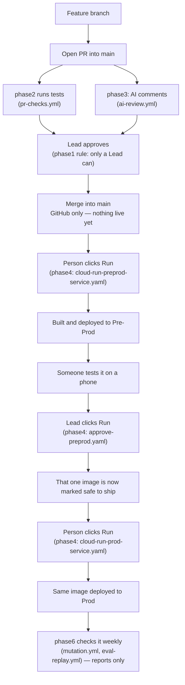

# Sujho GitHub Workflow — Plain Plan

Nothing here is live yet. Today, code still ships the old way: push to `main`, Cloud Build runs, and it often tags the image `latest`.

## People

Three people: two Leads (`@arnavtayal`, `@abhishektayal2802`) and one engineer (`@Prince-sujho`). Everyone works the same way — feature branch, then a pull request into `Sujho/sujho`'s `main`. Nobody pushes straight to `main`.

An AI leaves a comment on the pull request. That's advice, not approval. Only a Lead's approval counts, and it has to be the *other* Lead — Prince can never approve his own or anyone's PR. Merging never ships anything by itself.

## Where things run

- **Laptop** — free practice space. Fake data, no bill, nothing shared.
- **GitHub `main`** — the one shared branch. There's no `dev` or `pre-prod` branch.
- **GCP Dev** (`sujho-dev`) — a Google Cloud project for building and testing. Doesn't exist yet.
- **GCP Pre-Prod** (`sujho-preprod`) — for phone/WhatsApp testing before real users see it. Doesn't exist yet.
- **GCP Prod** (`sujho-478914`) — real users. Already live.

Dev, Pre-Prod, and Prod are Google Cloud projects, not GitHub branches.

## How a change actually ships

1. Open a pull request into `main`. AI comments, tests run, a Lead approves, then merge. Nothing is live yet — this only changes GitHub.
2. A person opens GitHub Actions, picks **one** service or job, and clicks **Run**. This builds it and puts it on Pre-Prod only.
3. Someone tests it on Pre-Prod (phone, WhatsApp).
4. Once it looks right, a Lead opens the **Approve** form, picks that one piece and the exact commit they tested, and clicks Run. This is the only thing that marks an image as safe to ship.
5. A person opens the **Prod** form for that same piece and clicks Run. It deploys the exact same image — never rebuilt.

Every step above is one click on one piece. There's no button that updates everything at once, and nothing runs on a schedule or automatically after merge.

Same thing as a picture, with the actual file that runs at each step:

A Cloud Run job follows this same picture through different files — see "Cloud Run jobs" below. `phase5` isn't shown here because it was tried and removed (see the table below).

## What's in this repo

Six folders, one per step above. Each one only affects GitHub or Google Cloud when someone runs its `apply-phaseN.sh` with `--apply` — never by itself.

| Folder | Does |
|---|---|
| `phase1` | Decides who can approve a pull request. Only the two Leads. |
| `phase2` | Runs the test suite automatically on every pull request. |
| `phase3` | Has an AI leave review comments on every pull request. |
| `phase4` | The actual shipping system: build, test on Pre-Prod, get a Lead's approval, ship to Prod, and undo a bad deploy if needed. |
| `phase4/jobs` | Same system, for the run-once-and-stop jobs instead of live services. |
| `phase5` | An early idea we tried and removed — it looked safe without actually checking a human had tested anything. |
| `phase6` | A weekly automatic check that things still work. Just a report — never blocks anything. |

Inside every `phaseN` folder, three files do the same three jobs everywhere:

- `apply-phaseN.sh` — puts that phase's files onto GitHub. Only when someone types `--apply`.
- `verify-phaseN.sh` — checks it actually worked.
- `validate.py` — checks the logic on your own laptop, no internet needed.

## Rules worth remembering

- Passwords and keys live in Google Cloud's Secret Manager, never in GitHub.
- Only the two Leads can approve a pull request into `main` — enforced by GitHub, not just habit.
- A required GitHub check is never turned on until it's actually run once.
- Pre-Prod's databases are separate from Prod's, refreshed by copying **from** Prod (never written back).

## Cloud Run jobs

Some things aren't a live website — they're jobs that run once and stop, like grading WhatsApp sessions or importing content. They get the same "open one file, pick one, click Run" treatment as everything else. Live job names: `knowledge-store-sessions`, `-ingest`, `-remove`, `-import-ncert`, `-import-educart`.

## What's still missing

- The Dev and Pre-Prod Google Cloud projects don't exist yet — someone with billing access has to create them.
- Whether Prod's real user data can be copied into Pre-Prod for testing, or needs to be anonymized first, is still an open call for the Leads.
- No dedicated test WhatsApp number yet.
- No machine set up yet to run the weekly mutation check.
