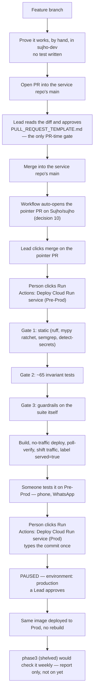

# Sujho GitHub Workflow — Plain Plan

Nothing here is live yet. Today, code still ships the old way: push to
`main`, Cloud Build runs, and it often tags the image `latest`.

This plan reflects `decisions-24-09-26.md` as the final word — it changed
the shape of review and testing significantly from the original review
outcome doc, and this file has been updated to match, not the other way
round.

A naming note, since it trips people up: the folders in this repo are
named `phase1`, `phase2`, `phase3` (renamed from the original `phase1`,
`phase4`, `phase6` — `phase2` old and `phase3` old were deleted outright).
Nothing below refers to a folder called "phase2" meaning the deleted
PR-time checks — that concept is gone, full stop; `phase2` the *folder*
is the build/deploy/rollback system, unrelated by number.

## People

Three people: two Leads (`@arnavtayal`, `@abhishektayal2802`) and one
engineer (`@Prince-sujho`). Everyone works the same way — feature branch,
then a pull request into `Sujho/sujho`'s `main`. Nobody pushes straight to
`main`.

**Nothing automated runs on the pull request.** A Lead reads the diff
against `.github/PULL_REQUEST_TEMPLATE.md` and approves — that's the only
gate before merge, and it has to be the *other* Lead; Prince can never
approve his own or anyone's PR. Merging never ships anything by itself.

Before opening the PR, the engineer proves the feature works themselves,
by hand, in the Dev sandbox — no test written, no CI involved. That's a
different question from "is this code correct," and it's answered by a
different person, at a different moment.

## Where things run

- **Laptop** — free practice space. Fake data, no bill, nothing shared.
- **GitHub `main`** — the one shared branch. There's no `dev` or
  `pre-prod` branch.
- **GCP Dev** (`sujho-dev`) — a sandbox. Console access, capped compute,
  nothing on by default. This is where the engineer proves a feature
  works, by hand. **No CI runs here at all.**
- **GCP Pre-Prod** (`sujho-preprod`) — where builds actually happen, get
  checked by three automated gates, and get phone/WhatsApp tested. Holds
  the image warehouse. Doesn't exist yet.
- **GCP Prod** (`sujho-478914`) — real users. Already live. Only ever
  reads an already-built, already-tested image — never builds, never
  tests.

Dev, Pre-Prod, and Prod are Google Cloud projects, not GitHub branches.

## How a change actually ships

1. Branch off the service repo. Prove the feature works yourself, by
   hand, in Dev. No test, no CI.
2. Open a PR into that repo's `main`. A Lead reads the diff and approves.
   Merge. Nothing is live yet.
3. A workflow on that repo auto-opens a one-line pull request on
   `Sujho/sujho`, moving that one service's pointer to the new commit. A
   Lead clicks merge on it — that click is what decides which changes
   ship together. Still nothing live.
4. A person opens GitHub Actions, picks **one** service or job, and
   clicks **Run**. This is where the three gates actually run — static
   checks, the ~65 kept tests, and the suite's own guardrails — followed
   by build, no-traffic deploy, a poll-until-converge check, then traffic
   moves. Only after all of that does Pre-Prod actually serve it.
5. Someone tests it on Pre-Prod (phone, WhatsApp).
6. A person opens the **Prod** form for that same piece, types the
   tested commit once, and clicks Run. The run pauses — a Lead is
   notified, sees the service/commit/who-started-it, and clicks Approve.
   Only then does it deploy. The exact same image, never rebuilt.

Every step above is one click on one piece. There's no button that
updates everything at once, and nothing runs on a schedule or
automatically after merge — except step 3's pointer PR, which still needs
a human to click merge.

A Cloud Run job follows this same picture through different files — see
"Cloud Run jobs" below. The old "Phase 5" idea isn't shown here because it
was tried and removed (see the table below). The old "Phase 2" (automated
PR checks) isn't shown either — deleted outright, see "What changed" below.

## What's in this repo

| Folder | Does |
|---|---|
| `phase1` | Decides who can approve a pull request. Only the two Leads. |
| `phase2` | The actual shipping system: three gates in the Pre-Prod build, deploy, get a Lead's approval, ship to Prod, undo a bad deploy if needed. (Renamed from the original `phase4`.) |
| `phase2/jobs` | Same system, for the run-once-and-stop jobs instead of live services. |
| `phase2/pointer-bump` | The auto-pointer-PR workflow — goes in every service repo, not `Sujho/sujho`. |
| `phase3` | Shelved, not deleted. A weekly automatic check. Needs the test suite committed, `phase2` running a while, and a runner machine — none of which exist yet. (Renamed from the original `phase6`.) |
| `.github/PULL_REQUEST_TEMPLATE.md` | The checklist a Lead reads while reviewing — this used to be an AI prompt (the old `phase3/REVIEW.md`); it's now written for a human, since nothing automated reads it anymore. |
| `.github/dependabot.yml` | Weekly dependency + pinned-Action update checks — a template for every repo. |

The old "Phase 2" (automated PR checks) and old "Phase 5" (a removed
safety idea) are gone entirely — no folder exists for either anymore.

Inside `phase1` and `phase2`, three files do the same three jobs:

- `apply-phaseN.sh` — puts that phase's files onto GitHub. Only when
  someone types `--apply`.
- `verify-phaseN.sh` — checks it actually worked.
- `validate.py` — checks the logic on your own laptop, no internet
  needed. This only checks that the files are internally consistent —
  it does not run the actual Cloud Build recipe or call real GCP, so a
  green `validate.py` is not proof the pipeline works end to end.

## What changed from the original review outcome doc

`decisions-24-09-26.md` moved the goalposts on testing and review
significantly:

- **The old Phase 2 (automated PR checks) is gone entirely.** Nothing
  automated runs on the PR anymore — not tests, not lint, not secret
  scanning. All of it moved into the Pre-Prod build's three gates,
  because merging deploys nothing, so there's nothing to protect by
  gating the merge itself.
- **The AI reviewer is gone entirely**, not just de-fanged. It was
  unproven (never run once) and the model call itself was the expensive,
  non-deterministic part. Semgrep survives, moved into Gate 1.
- **The test suite shrinks from hundreds of tests to about 65** — kept
  only if they don't need touching when a feature ships, just when a
  decision or the platform changes.
- **Feature verification is a human step in `sujho-dev`**, not a test
  anyone maintains.

None of this is optional or a suggestion — it's the design this plan is
now built around.

## Rules worth remembering

- Passwords and keys live in Google Cloud's Secret Manager, never in
  GitHub.
- Only the two Leads can approve a pull request into `main` — enforced by
  GitHub, not just habit.
- Pre-Prod's databases are separate from Prod's, refreshed by copying
  **from** Prod (never written back), and anonymised before that happens.
- `sujho-dev` has no CI. Nothing here ever builds or deploys from it.
- Production can only ever *read* from the image warehouse
  (`sujho-preprod`) — never write to it, never build from it.
- Every build recipe is submitted with `gcloud builds submit --no-source`,
  which starts with a completely empty workspace. The very first step in
  every recipe fetches `Sujho/sujho` itself at the exact commit, inline —
  it can't call any script from this repo, because nothing from this repo
  exists in the workspace yet.

## Cloud Run jobs

Some things aren't a live website — they're jobs that run once and stop,
like grading WhatsApp sessions or importing content. They get the same
"open one file, pick one, click Run" treatment as everything else. Live
job names: `knowledge-store-sessions`, `-ingest`, `-remove`,
`-import-ncert`, `-import-educart`.

`knowledge-store-sessions` runs hourly against real user transcripts and
has **zero test coverage today** — flagged in `decisions-24-09-26.md` as
the single biggest gap here, bigger than anything else in this document.
Parked as priority 2, not solved by this plan. Job builds run Gate 1
(static) and Gate 3 (guardrails), but skip Gate 2 entirely — there is
nothing to run yet.

## What's still missing

- The Pre-Prod Google Cloud project (`sujho-preprod`) doesn't exist yet —
  someone with billing access has to create it.
- IAM roles aren't granted anywhere yet — `phase2/IAM-table.md` has the
  exact table; it's applied by hand, not by script.
- Whether Prod's real user data can be copied into Pre-Prod for testing,
  or needs to be anonymized first, is still an open call for the Leads.
- No dedicated test WhatsApp number yet.
- No machine set up yet to run the weekly mutation check — and `phase3`
  stays off until the test suite itself is committed and `phase2` has
  been running for a while.
- `sujho-ops-mcp`'s deploy path is undocumented.
- `Eval-Suite/` isn't addressed by either governing doc.
- None of the Cloud Build recipes here have been run against real GCP —
  this plan has been checked for internal consistency (do the files agree
  with each other and with the docs), not for whether `gcloud` would
  actually accept every flag and step as written.
